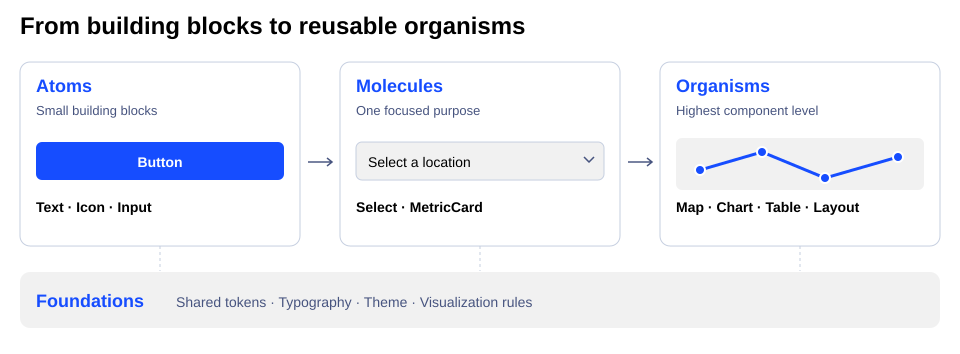
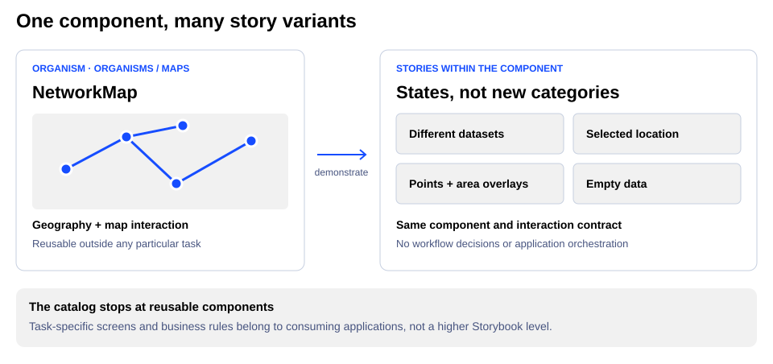

# Storybook organization

## Philosophy

Storybook is a catalog of reusable Easy UI components, from shared visual rules
to substantial interactions. Its organization should help someone find the
smallest reusable piece they need. It is not a catalog of product workflows,
business rules, or proposed application screens.

Atomic design is our composition model, not a strict implementation taxonomy.
A component's level describes its responsibility, not its line count, number
of children, or underlying library. The hierarchy does not require matching
source folders, new package boundaries, or a chain of component inheritance.

- **Build upward through composition.** Reuse smaller components and shared
  theme tokens rather than introducing a separate visual system for each example.
- **Separate reusable behavior from workflow context.** A chart or map should
  be understandable independently of pricing or network investigation. Workflow
  headings, business explanations, and orchestration belong to the consuming
  application, not a separate Storybook layer. Incidental presentation chrome
  should not become required domain context.
- **Make discovery practical.** Atomic levels explain the building blocks;
  functional subgroups such as Forms, Charts, and Maps make them easy to locate.
  Prefer one clear home to duplicate entries or competing classifications.
- **Keep examples honest.** Stories demonstrate states and compositions of a
  component. A new city, dataset, theme, or interaction state is a story variant,
  not automatically a new component or navigation category.

## Levels

The arrows illustrate composition, not a mandatory dependency chain. Foundations
support every level; an organism can use atoms directly.

Storybook follows these levels, with functional subgroups where useful:

- **Foundations:** Shared visual rules and design guidance, including tokens,
  typography, themes, and visualization encodings.
- **Atoms:** Small building blocks, including buttons, text, icons, basic inputs,
  and layout primitives.
- **Molecules:** Focused combinations of building blocks, including selects,
  date pickers, cards, menus, and metrics.
- **Organisms:** Larger reusable interactions, including charts, maps, tables,
  navigation, dialogs, and reusable page or form layouts.

**Organisms is the highest component level.** We deliberately use only the
component levels of atomic design; Storybook has no Templates, Patterns, or
Pages layer. Reusable layout components live under `Organisms/Layouts`.
Task-specific screens belong in application examples outside Storybook, not
under Organisms with a different label.

## Choosing a home

Classify by responsibility rather than implementation size:

1. Shared visual rules or design guidance belong in Foundations.
2. A small building block belongs in Atoms.
3. A focused combination serving one local purpose belongs in Molecules.
4. A substantial reusable interaction or layout belongs in Organisms.
5. A populated, task-specific workflow does not belong in this Storybook.

Use judgment at the Molecules/Organisms boundary; implementation complexity alone
does not settle it. Choose the component's primary responsibility and document
an unusual placement rather than adding a second home.

For example, `NetworkMap` belongs under `Organisms/Maps` and standalone comparison
charts belong under `Organisms/Charts`. The network investigation screen and
price-review queue are application workflows and are not catalog entries.
Layout primitives are Atoms; reusable product layouts are Organisms.

The map owns reusable geography and interaction. Stories demonstrate that
component's capabilities without prescribing a task or coordinating an entire
application.

Keep variants within the component's stories. Start with its simplest meaningful
use, then show relevant states and composed use cases. Moving an example into
Organisms does not by itself establish a stable public API; that requires a
separate component/API decision.

## Maintaining the hierarchy

Audit composition as well as navigation. Ordinary actions reuse `Button`;
custom-shaped actions reuse `UnstyledButton`. Layer choices reuse `Checkbox`
and `RadioGroup`, and workflow metrics reuse `MetricContent` rather than
recreating label/value/loading markup. `MetricContent` accepts `SignedValue`
elements so numeric presentation composes without moving workflow meaning into
the atom.

Use existing screen compositions as adoption references. `WorkspaceHeader`
provides a compact navigation and identity row without a required subtitle.
`KpiTile` provides a shell metric tile without an application data-provider
dependency. Both reuse Easy UI building blocks.
Standalone `Pill` labels and `PillButton` actions are Atoms; `PillGroup` remains
a Molecule that adds tag-list navigation and removal to the shared pill atom.

Keep layout, swatches, semantic tables, and engine-owned rendering as native
markup where appropriate. Specialized slider handles and third-party map
controls are not ordinary action buttons. Reuse must preserve their interaction
contracts, not force a wrapper around every element. Verify keyboard activation,
controlled state, focus recovery, themes, and compact layouts when replacing a
hand-built control.

Set the CSF metadata `title` to the navigation path, such as
`Organisms/Charts/CompactTimeSeries`. Documentation attached with `Meta of` follows
that path automatically. The root order lives in `preview.tsx`.

Do not add component levels above Organisms. The discovery globs in `main.ts`
include component stories outside `src/examples` by default. Within
`src/examples`, only standalone chart, map, and encoding stories are included;
workflow demos such as pricing review and network investigation remain outside
the catalog. Their source is retained for standalone examples and tests.
New stories must demonstrate a reusable component, not reintroduce a workflow
category.

When moving an existing entry, preserve its metadata `id`. Entries moved from the
previous hierarchy have explicit legacy IDs so bookmarks, documentation URLs,
and interaction references continue to work. New entries can use Storybook's
generated IDs.

Treat navigation moves as documentation changes. Keep story behavior, component
APIs, source directories, and public exports unchanged unless those changes are
explicitly part of the task.
