# Recharts versus ECharts

PR #3 branches from PR #1 at `a0bd1a8`. Both versions retain all six lightweight
components and render the same 18 synthetic analytical datasets. The experiment
does not change Easy UI's published analytical API or default library.

## Results

| Measure                                                  | ECharts 6.1.0 | Recharts 3.10.1 + native matrix |
| -------------------------------------------------------- | ------------: | ------------------------------: |
| Complete analytical page, gzip JavaScript                | 497,338 bytes |                   232,380 bytes |
| Additional JavaScript beyond shared comparison shell     | 425,023 bytes |                   160,065 bytes |
| Gzip CSS                                                 |   9,144 bytes |                     9,144 bytes |
| Median navigation to 18 rendered plots, five CI samples  |        564 ms |                          556 ms |
| Desktop/mobile data tables match                         |           Yes |                             Yes |
| Renderer requested on the other library's isolated route |            No |                              No |

Recharts cuts this page's JavaScript transfer by **53.3%**. Initial rendering is
effectively tied in this small, unthrottled desktop experiment. Neither the
fixtures nor the timings establish dense-data or mobile-device performance.
ECharts still imports its full engine; a modular build could narrow the size gap.

The bundle comparison includes React, fixture data, shared presentation, and
renderer integration. CSS is separate; fonts are excluded. These numbers should
not be compared directly with engine-only export measurements from the earlier
review. See [exact bundles](bundle-sizes.json) and [browser results](validation.json).

## What the experiment establishes

- Standard trends, thresholds, direct labels, compositions, scatter, Sankey,
  hierarchy, CDF, and prediction bands work with Recharts on this corpus.
- Heatmaps require an additional native HTML/CSS component. Box summaries require
  a custom Bar shape, with supplied quartiles and a complete tooltip. Waterfall
  bars require the ledger-to-range transformation and signed formatting.
- Recharts' controlled zoom passes both refresh cases. The existing ECharts
  wrapper still resets a 30–70% responsive selection to 10–90%, and converts a
  12.5–17.5% interaction into 6.25–8.75% when the domain doubles.
- ECharts retains advantages in built-in breadth, Canvas rendering, and Sankey
  adjacency emphasis. Those have not been reproduced by this experiment.
- Both retain exact tables. Native chart keyboard interactions supplement those
  tables where supported; this is not a claim of universal mark-level accessibility.

**Assessment:** Recharts is a viable dashboard alternative with a much smaller
transfer cost and explicit React interaction state. The tradeoff is ownership of
specialized components. Keep this as an alternative until the native matrix,
summary marks, missing flow interactions, and representative data volumes have
been accepted. The experiment does not justify a wholesale migration on size alone.

## Rendered pairs

ECharts is on the left at desktop widths and first on mobile. All values are synthetic.

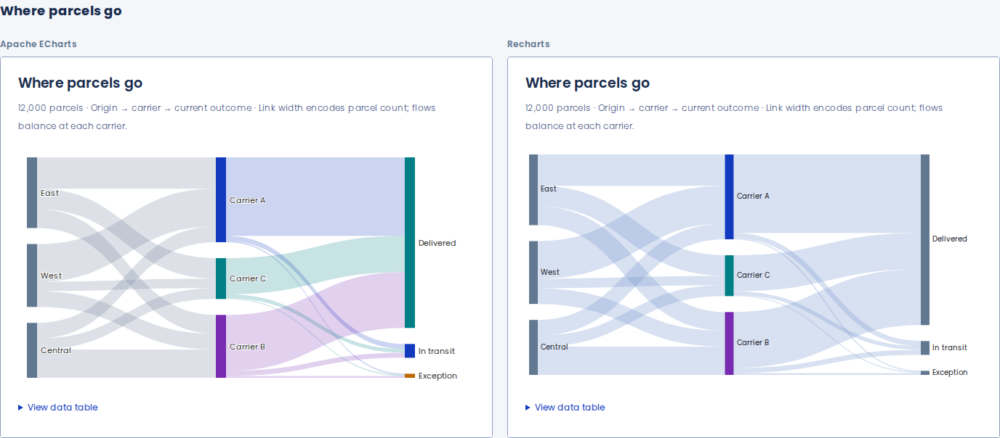
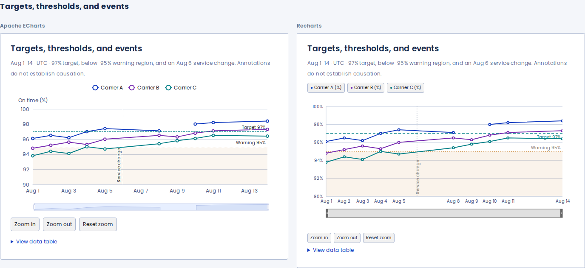
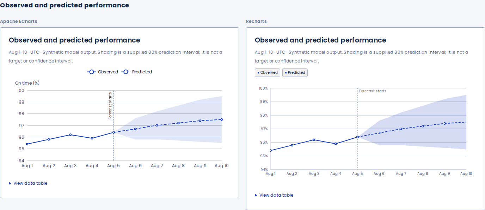

Specialized plots and direct labels

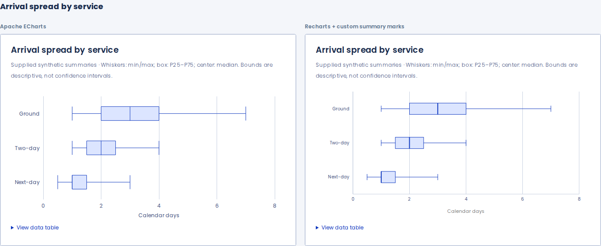
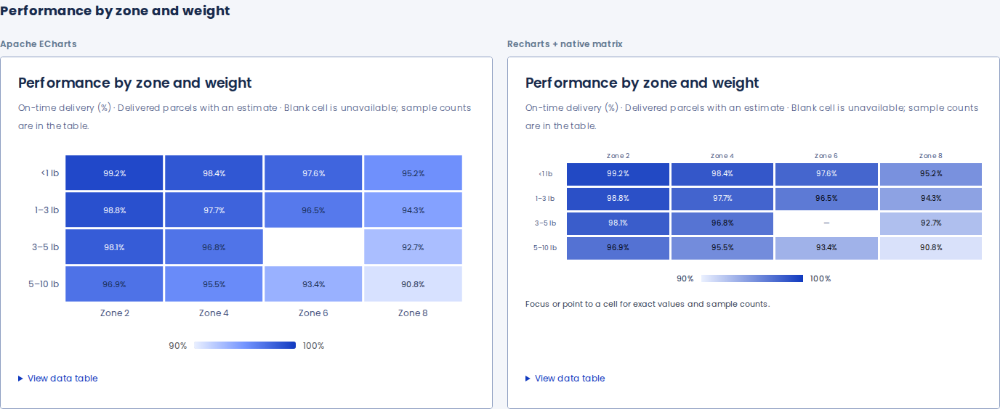
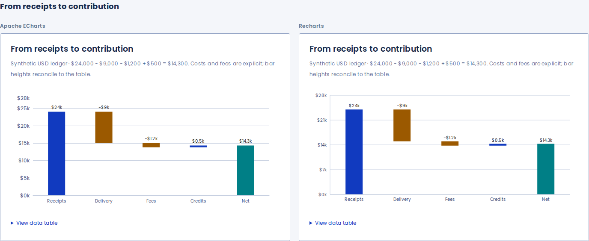
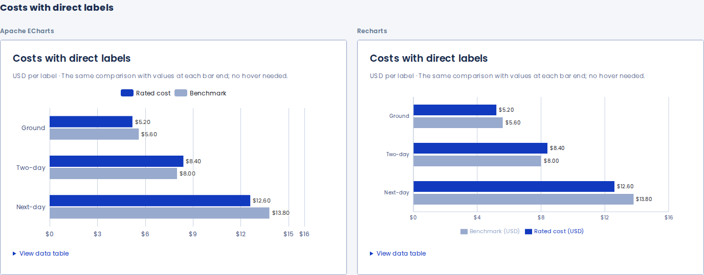
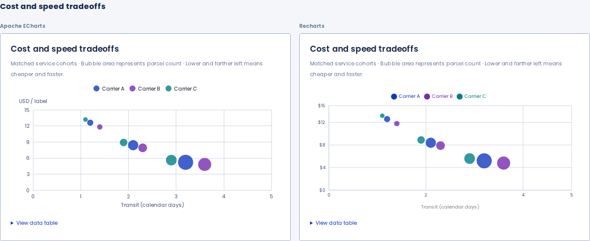

Mobile comparisons

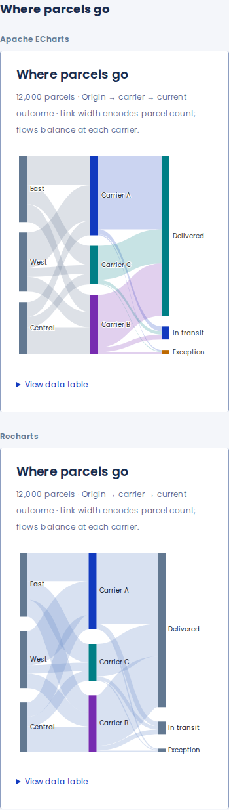
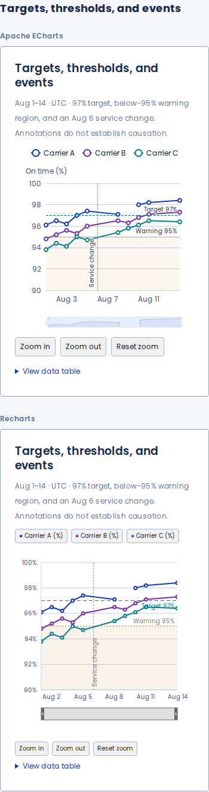
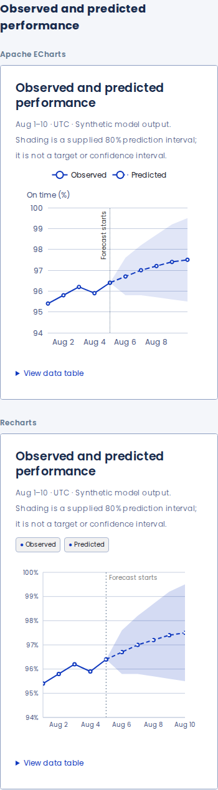

Live refresh and zoom

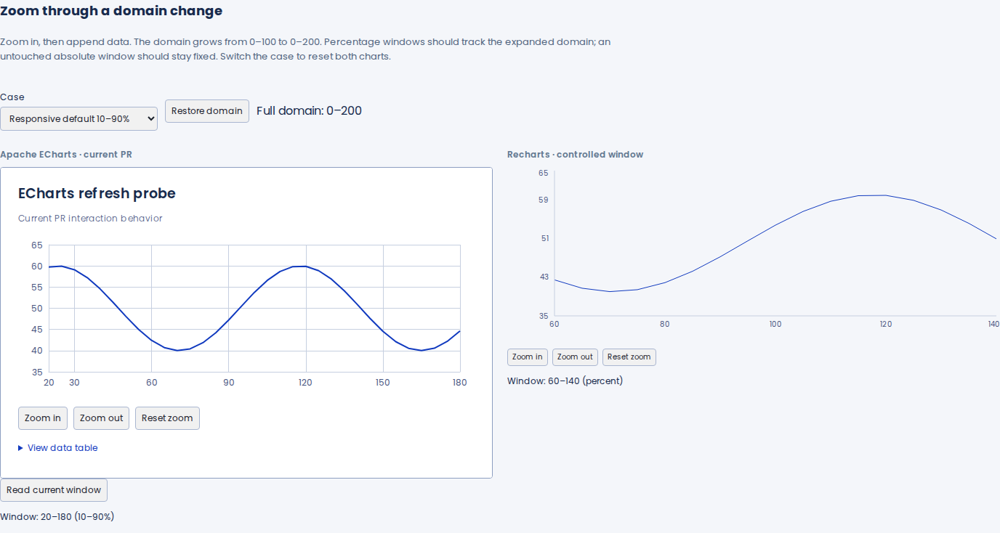
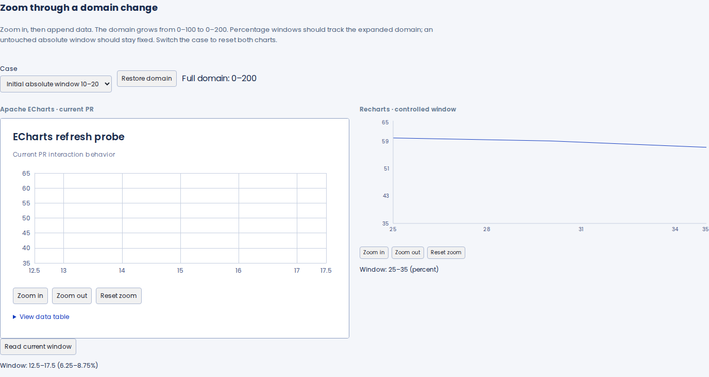

## Reproduce and inspect

- [Harness source and commands](../../../scripts/preview-metrics/comparison/README.md).
- [All captures and runnable build](https://github.com/lanej/easy-ui/actions/runs/34721624175/artifacts/10306122414).
- [Passing browser, type, and bundle checks](https://github.com/lanej/easy-ui/actions/runs/34721624175).
- [Full package CI](https://github.com/lanej/easy-ui/actions/runs/34721624168).

Captured head: `315afd3cdcdba5d4958955054dd6cb13b2abfee3`. The validation file's
`source` is GitHub's corresponding pull-request merge commit,
`d3074b15eddafdc6a35f3091bd22975aaf696c42`. The original PR #1 branch is unchanged.

The color-preference control exercises renderer lifecycle changes. Easy UI's
default theme supplies its light palette for both preferences; a complete dark
theme requires separate token overrides. This comparison does not simulate one.
