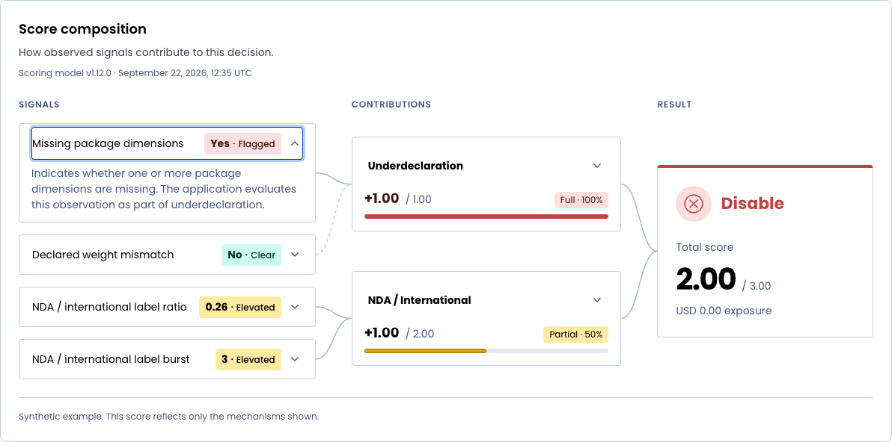

# ScoreComposition

Native score explanations belong with the lightweight data visualizations, alongside MetricCard and BarList. This component has a constrained signals → contributions → result topology and no graph-engine dependency.

## Ownership

The application supplies stable IDs, observed values, weighted/capped scores, source relationships, final aggregation, outcome wording and sentiment, and provenance. Easy UI preserves array order and exact supplied values. It does not infer risk, thresholds, causality, statistical confidence, or flow conservation.

## Public components

- `ScoreComposition`: optional heading/context/frame, CSS Grid layout, named lists, and measured SVG connections.
- `ScoreSignal`: compact bordered observation box with internal text clearance, optional explicit sentiment/status, and true zero, false, missing and invalid states.
- `ScoreContribution`: exact signed score and supplied cap, valid-range meter with textual fullness and explicit sentiment, readable source names, and optional shared Disclosure.
- `ScoreResult`: prominent supplied decision followed by the exact score and optional cap, sentiment-based outcome treatment, and application context.
- `ScoreConnector`: one decorative Bézier path for a containing SVG.

All components and their documented types use the `@easypost/easy-ui/ScoreComposition` entry. Build discovery generates CJS/ESM, declarations, and legacy compatibility entries. The shared stylesheet contains their Sass-token-based presentation.

## Acceptance

Three columns at content widths of at least 48rem; stacked reading order in narrower containers. Exact data remains visible at both sizes. Source labels are visible when stacked and available to assistive technology in three columns. Independently placed contribution cards retain visible sources. No floating SVG text, chart engine, React Flow, drag handles, or zoom controls. Curves stay in gutters and follow resized nodes and opened explanations, including right-to-left layouts.

Meters require positive finite caps and scores within the zero-based range. Missing and invalid scores are labelled; negative and above-cap scores retain exact text with an outside-scale note and no filled meter. Result totals are never recomputed. Unknown sources remain visibly identifiable without fabricated edges. Repeated references are deduplicated.

Signal sentiment is application-supplied (`neutral`, `positive`, `warning`, or `negative`) and defaults to neutral. Boolean and numeric values never imply sentiment. Nonneutral values use a tinted value/status pill with a visible `statusLabel`, or a localizable “Positive”, “Caution”, or “Negative” fallback. Neutral values can also carry a status label. The exact observation and textual interpretation remain readable without color. Blank status labels use the fallback; missing and invalid observations suppress stale sentiment/status and retain neutral missing/invalid text. Applications update the value and its interpretation together.

Valid contribution meters distinguish exact fullness from sentiment. A score equal to its positive finite cap is “Full · 100%”, zero is “None · 0%”, and values between them are “Partial” with a whole-number percentage. Rounded boundary values use `<1%` or `<100%` to preserve the distinction from empty/full; supplied scores, caps, and meter widths are never rounded or changed. State labels are localizable through `fullContribution`, `partialContribution`, and `noContribution`. Application-supplied contribution sentiment uses the same neutral/positive/warning/negative choices and defaults to neutral. It colors the status and fill without interpreting fullness as favorable or unfavorable. The risk example explicitly colors its full contribution negative and partial contribution warning. Missing, invalid, and outside-scale values suppress the status and tint; applications keep sentiment current when values change.

The terminal result leads with the supplied disposition before the numeric score in both visual and DOM order. Its explicit negative, positive, or default neutral sentiment controls the decision treatment independently of score direction or magnitude. Icons are decorative; the visible outcome text carries the meaning. A supplied disposition remains authoritative when the score is unavailable, and an omitted disposition never causes the component to invent one.

Signal titles with descriptions and contribution titles with explanations act as shared Disclosure triggers with a chevron; signal details open below the observation row and contribution explanations below the meter. Exact observations and statuses stay visible and describe the signal control for assistive technology. Each node expands independently, retaining its state through record refresh and reordering. Hovering a card or focusing its controls emphasizes its incoming and outgoing paths with a neutral stroke. Focus takes precedence. Explicit `ScoreSignalData.triggered: false` makes outgoing paths lighter and dashed; observations and sentiment never imply trigger state. Visible status text and source labels retain equivalent meaning.

Verify keyboard disclosure, stable state through record reordering, optional/external headings, shared signals, empty and missing data, explicit signal sentiment and localization, SSR, observer cleanup, container resizing, narrow widths, large text, theme changes, forced colors, browser console and accessibility scans. Signal tests must cover neutral numeric/boolean defaults, identical values with different supplied meanings, status updates, and unavailable/invalid values clearing stale interpretations. Contribution tests must distinguish the same score against different caps, exact-full and near-boundary values, independently supplied sentiment, localized fullness labels, and unavailable/outside-scale transitions clearing stale status and tint. Result tests must verify decision-before-score reading order, explicit positive/negative/neutral interpretation of the same numeric score, and independent outcomes when scores are unavailable. Browser checks must confirm signal borders and padding and sample every SVG curve against visible text rectangles to catch connector/text collisions. Verify the actual packed entry in both package layouts and both supported TypeScript resolution modes.

The [View Rule contract](../../.ui-review/README.md#score-composition-contract) covers default, expanded/larger-text, and dark states at desktop, 320px, and 4K. Its finite comparison retains all seven example nodes; source labels accompany the stacked layout. Browser audits additionally measure connector clearance and 3:1 meter-boundary contrast. The golden warning fill uses a contrasting inset edge to preserve its color and exact width.

See [the API and stories](../../easy-ui-react/src/ScoreComposition/ScoreComposition.mdx) and [browser review instructions](../../scripts/preview-metrics/README.md).
